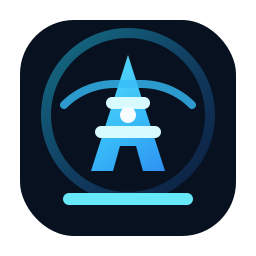

<div align="center">
  
  <h1>Tower</h1>
  <p><strong>把分散的扫描能力，收束成一座可调度、可观测、可复用的资产风险控制塔。</strong></p>

  <p>
    
    
    
    
  </p>
</div>

---

## 推荐

需要稳定体验纯血版 GPT 和 Claude，可以试试我的 AI 中转站：

**SantaAi**：<https://santaa.ai>

SantaAi 聚合纯血版 GPT、Claude 等模型能力，适合开发、写作、自动化和安全分析等日常高频场景。

---

## Tower 是什么

Tower 是一个面向授权安全运营的资产风险平台。

它不是单个扫描器，而是一套把扫描工具、任务队列、资产库、漏洞结果和 Worker 节点统一管理起来的系统。你可以把它部署在中心节点，把 Worker 放到不同网络区域，让扫描执行靠近目标，让结果回流到统一控制台。

Tower 适合这些场景：

- 需要持续盘点互联网暴露面的团队。
- 需要在多个网络区域部署扫描节点的内网安全团队。
- 需要把 POC 验证、指纹识别、端口探测、子域发现统一编排的场景。
- 需要多人协作、按工作空间隔离数据的资产治理场景。

## 设计思路

Tower 的核心思路很简单：

```text
先知道有什么资产
再判断资产暴露了什么服务
再识别服务对应的技术和风险
最后把结果沉淀为可追踪、可复扫、可通知的数据
```

系统围绕三类对象运转：

| 对象 | 作用 |
| --- | --- |
| Asset | 资产沉淀层，保存站点、端口、域名、IP、截图和历史变化 |
| Task | 调度编排层，描述扫描目标、扫描阶段、模板和执行状态 |
| Worker | 执行层，拉取任务、运行扫描模块并回传结果 |

## 工作流

```text
创建任务
  │
  ▼
任务拆分与入队
  │
  ▼
Worker 拉取任务
  │
  ▼
端口 / 站点 / 指纹 / 子域 / POC 扫描
  │
  ▼
结果归并到资产库
  │
  ▼
控制台检索、复扫、通知、导出
```

## 你会得到什么

### 控制台

- 资产视图：站点、端口、IP、域名、截图、应用指纹。
- 风险视图：漏洞列表、POC 结果、风险统计。
- 任务视图：任务创建、执行进度、定时任务、扫描模板。
- 节点视图：Worker 在线状态、并发设置、日志与控制台。

### 后端

- API 服务默认监听 `8888`。
- Task RPC 默认监听 `9000`。
- MongoDB 存储资产、任务、用户、漏洞和配置。
- Redis 承载队列、Worker 状态、Install Key 和调度中间状态。

### Worker

- 通过 Install Key 注册。
- 只连接 API，不需要暴露数据库和 Redis。
- 支持本机运行、远程节点运行和容器化部署。

## 快速启动

```bash
git clone https://github.com/VpSanta33/Tower.git
cd Tower
chmod +x tower.sh
./tower.sh
```

控制台地址：

```text
https://<server-ip>:3333
```

默认登录：

```text
admin / 123456
```

首次登录后请修改默认密码。

## 单二进制构建

API 支持把前端构建产物嵌入到二进制中，构建后访问 `http://<server-ip>:8888` 即可打开控制台。

```bash
scripts/build-single.sh
./bin/tower -f api/etc/tower.yaml
```

## 开发模式启动

### 1. 启动 MongoDB 和 Redis

```bash
docker-compose -f docker-compose.dev.yaml up -d
```

### 2. 设置运行环境

```bash
export TOWER_MONGO_URI='mongodb://localhost:27017/?directConnection=true'
export TOWER_REDIS_HOST='localhost:6379'
export TOWER_REDIS_PASS=''
export TOWER_JWT_SECRET='replace-with-a-random-secret'
```

### 3. 启动 RPC

```bash
go run rpc/task/task.go -f rpc/task/etc/task.yaml
```

### 4. 启动 API

```bash
go run api/tower.go -f api/etc/tower.yaml
```

### 5. 启动 Web 控制台

```bash
cd web
npm install
npm run dev
```

开发访问地址：

```text
http://localhost:3333
```

## 接入 Worker

登录控制台后，进入 `Worker 管理` 页面。页面会生成当前服务可用的 Install Key 和启动命令。

二进制运行：

```bash
./bin/tower-worker -k <install_key> -s http://<api_host>:8888
```

源码运行：

```bash
go run cmd/worker/main.go -k <install_key> -s http://localhost:8888
```

如果 Worker 没有上线，优先检查：

```text
API 地址是否能从 Worker 节点访问
Install Key 是否和控制台显示一致
API 服务是否连接到了同一个 Redis
防火墙是否放行 8888
```

## 编译产物

```bash
go build -o bin/tower-rpc ./rpc/task/task.go
go build -o bin/tower-api ./api/tower.go
CGO_ENABLED=0 go build -o bin/tower-worker ./cmd/worker
```

前端：

```bash
cd web
npm run build
```

`bin/` 和 `web/dist/` 是构建产物，默认不进入 Git。

## 配置入口

| 文件 | 说明 |
| --- | --- |
| `api/etc/tower.yaml` | API 服务配置 |
| `rpc/task/etc/task.yaml` | RPC 服务配置 |
| `docker-compose.yaml` | 完整部署 |
| `docker-compose.dev.yaml` | 本地依赖 |
| `docker-compose-worker.yaml` | 独立 Worker |

敏感配置建议使用环境变量：

```text
TOWER_MONGO_URI
TOWER_REDIS_HOST
TOWER_REDIS_PASS
TOWER_JWT_SECRET
```

## 仓库结构

```text
api/             API 服务入口与业务逻辑
rpc/             Task RPC 服务
cmd/worker/      Worker 启动入口
worker/          Worker 执行逻辑
scheduler/       队列调度与任务恢复
scanner/         扫描模块封装
model/           MongoDB 数据模型
pkg/             通用组件
web/             Vue 控制台
docker/          容器配置
```

## 测试建议

快速验证：

```bash
go test ./api/internal/handler ./api/internal/svc ./scanner
```

前端测试：

```bash
cd web
npm run test
```

完整测试依赖 MongoDB、Redis 和部分扫描运行环境。如果没有本地数据库，涉及资产扫描集成测试的用例可能会等待数据库连接并最终超时。

## 使用边界

Tower 只应在获得授权的资产范围内使用。请不要将它用于未授权扫描、攻击测试或任何违法用途。

## License

[MIT](LICENSE)
